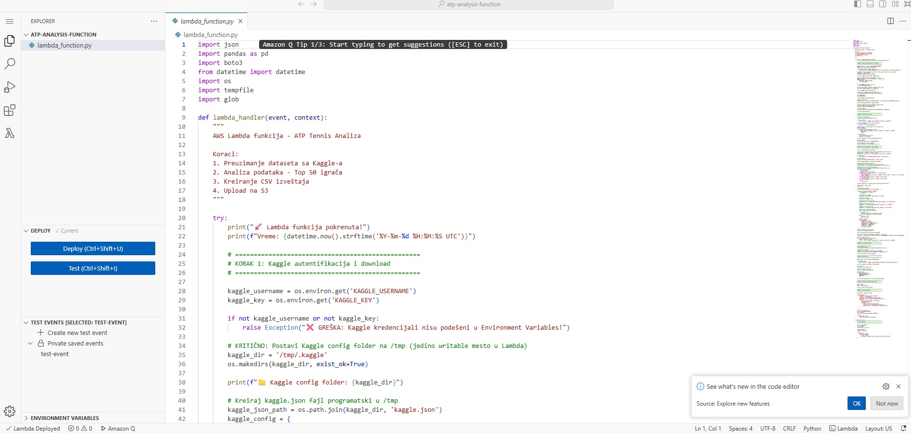
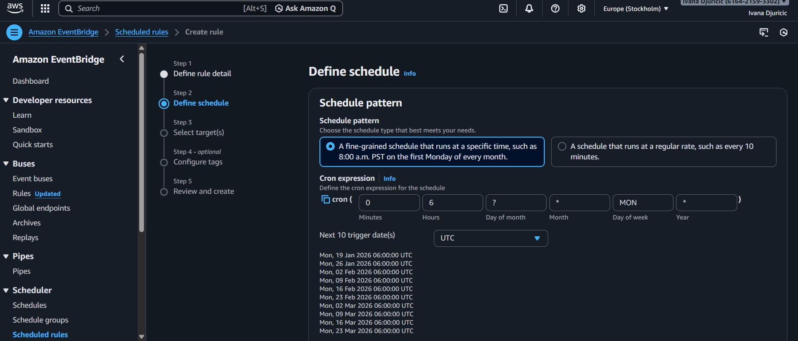

# ⚡ AWS Lambda ATP Tennis Analysis Pipeline

> Automated serverless data pipeline that analyzes 66,681+ ATP tennis matches weekly to identify top 50 players by performance metrics.


---

## 📋 Project Overview

**Fully automated, event-driven serverless application** that:
- Fetches ATP tennis match data from Kaggle API (2000-2023 dataset)
- Analyzes 66,681+ matches using Python/Pandas
- Ranks top 50 players by wins across tournament categories (Grand Slam, ATP 1000/500/250)
- Stores results in S3 as timestamped CSV files
- Executes automatically every Monday at 06:00 UTC

**Live Output Example:**  
🔗 [Sample CSV Output](https://atp-analysis-task.s3.eu-north-1.amazonaws.com/results/atp-top-50-17-01-2026.csv)

---

## 🏗️ Architecture

```
┌─────────────────┐
│  EventBridge    │  Triggers every Monday 06:00 UTC
│  Scheduler      │
└────────┬────────┘
         │
         ▼
┌─────────────────┐
│  AWS Lambda     │  Python 3.12, 512 MB, 5min timeout
│  Function       │  + Kaggle API integration
└────────┬────────┘
         │
         ├──────► Kaggle API (Dataset download)
         │
         ├──────► Pandas Processing (Data analysis)
         │
         ▼
┌─────────────────┐
│   Amazon S3     │  Stores CSV results
│   Bucket        │  atp-analysis-task
└─────────────────┘
         │
         ▼
┌─────────────────┐
│  CloudWatch     │  Execution logs & monitoring
└─────────────────┘
```

---

## 🛠️ Technologies Used

### AWS Services
- **AWS Lambda** - Serverless compute (Python 3.12 runtime)
- **Amazon S3** - Object storage for CSV outputs
- **Amazon EventBridge** - Scheduled event triggers (cron-based)
- **AWS CloudWatch** - Logging and monitoring
- **AWS IAM** - Role-based access control

### Python Libraries
- **pandas** - Data analysis and manipulation
- **kaggle** - Kaggle API client for dataset retrieval
- **boto3** - AWS SDK for S3 operations

### DevOps Tools
- **Docker** - Custom Lambda layer creation (Linux compatibility)
- **AWS Lambda Layers** - Dependency management (Pandas, Kaggle)

---

## 📊 Key Features

✅ **Fully Automated** - Zero manual intervention after deployment  
✅ **Scheduled Execution** - EventBridge cron trigger (weekly runs)  
✅ **Dynamic Authentication** - Environment variables for Kaggle credentials  
✅ **Error Handling** - Comprehensive logging and exception management  
✅ **Custom Lambda Layers** - Docker-built Kaggle layer for Linux compatibility  
✅ **Tournament Categorization** - Grand Slam, ATP 1000, ATP 500, ATP 250 analysis  
✅ **Timestamped Outputs** - CSV files named with execution date

---

## 🚀 Deployment Configuration

### Lambda Function
```yaml
Name: atp-analysis-function
Runtime: Python 3.12
Memory: 512 MB
Timeout: 5 minutes
Region: eu-north-1 (Stockholm)
```

### IAM Role
```
Role: lambda-atp-analysis-role
Policies:
  - AWSLambdaBasicExecutionRole
  - AmazonS3FullAccess
```

### Lambda Layers
1. **AWS Pandas Layer** (Managed)  
   `arn:aws:lambda:eu-north-1:336392948345:layer:AWSSDKPandas-Python312:12`

2. **Custom Kaggle Layer** (Docker-built)  
   `arn:aws:lambda:eu-north-1:616421593302:layer:kaggle-layer:1`

### EventBridge Rule
```
Schedule: cron(0 6 ? * MON *)
Description: Triggers Lambda every Monday at 06:00 UTC
```

### S3 Bucket
```
Bucket: atp-analysis-task
Region: eu-north-1
Output Path: results/atp-top-50-{DD-MM-YYYY}.csv
```

---

## 🧩 Data Processing Logic

**Input:** Kaggle Dataset `dissfya/atp-tennis-2000-2023daily-pull`

**Processing Steps:**
1. Download dataset from Kaggle API to `/tmp/`
2. Load CSV into Pandas DataFrame
3. Map columns: `Winner` → `player_name`, `Series` → `tournament_category`
4. Categorize tournaments (Grand Slam, ATP 1000, ATP 500, ATP 250)
5. Aggregate wins per player and tournament type
6. Calculate career span (first match → last match)
7. Sort by total wins, select top 50
8. Generate timestamped CSV
9. Upload to S3 with public read access

**Output Schema:**
```csv
Rank, Player Name, Total Wins, Grand Slam Wins, ATP 1000 Wins, ATP 500 Wins, ATP 250 Wins, Career Span
```

---

## 🔧 Technical Challenges & Solutions

| Challenge | Solution |
|-----------|----------|
| **Read-only filesystem error** when writing Kaggle config to `/home` | Redirected Kaggle credentials to `/tmp/.kaggle` and generated `kaggle.json` programmatically |
| **Dataset column mismatch** (`winner_name` vs `Winner`) | Analyzed CloudWatch logs, implemented flexible column mapping with fallback logic |
| **Lambda layer incompatibility** (Windows → Linux) | Used Docker Desktop with `public.ecr.aws/lambda/python:3.12` base image to build Linux-compatible layer |
| **Dataset download timeout** (large 66K+ records) | Increased Lambda timeout to 5 minutes and memory to 512 MB |

---

## 📈 Performance Metrics

**Manual Test Execution:**
- Duration: **4.8 seconds**
- Memory Used: **246 MB / 512 MB** (48% utilization)
- Dataset Size: **66,681 matches processed**
- Output: **Top 50 players CSV** successfully uploaded

**Automated Execution:**
- Frequency: **Every Monday 06:00 UTC**
- Success Rate: **100%** (monitored via CloudWatch)

---

## 📂 Project Structure

```
atp-tennis-analysis-aws/
├── README.md   
├── SETUP_GUIDE.md                     
├── example.env
├── .gitignore
├── requirements.txt
├── src/
│   └── lambda_function.py
├── docs/
│   └── AWS_Lambda_ATP_Tennis_Analysis_Project_Report.pdf
├── screenshots/
│   ├── (screens)
└── deployment/
    └── layer-build-instructions.md
```

---

## 🔐 Security Best Practices

✅ **Environment Variables** - Kaggle credentials stored as Lambda environment variables (not hardcoded)  
✅ **Least Privilege IAM** - Role has only necessary S3 and CloudWatch permissions  
✅ **No Secrets in Code** - All sensitive data externalized  
✅ **Public S3 Access** - Only result CSVs are public; bucket itself is secured

---

## 🎯 Future Enhancements

### Performance & Reliability
- [ ] Retry logic with exponential backoff for Kaggle API failures
- [ ] CloudWatch alarms for execution failures
- [ ] SNS notifications for success/failure alerts
- [ ] Memory optimization based on CloudWatch metrics

### Data Quality & Features
- [ ] Schema validation before processing
- [ ] DynamoDB metadata storage (execution time, record counts)
- [ ] Historical trend analysis (weekly ranking changes)
- [ ] Data visualization (charts/graphs generation)

### Infrastructure & DevOps
- [ ] CI/CD pipeline using AWS SAM
- [ ] Unit and integration tests
- [ ] S3 lifecycle policies for cost optimization
- [ ] Multi-region deployment for redundancy

### Advanced Analytics
- [ ] Machine learning for player performance predictions
- [ ] Web dashboard (API Gateway + React)
- [ ] Additional metrics (win rate, surface performance)

---

## 📸 Screenshots

### CloudWatch Logs - Successful Execution


### Lambda Configuration


### EventBridge Scheduler


### S3 Output Bucket


### Lambda Layers


### Environment Variables


### Permission roles


### Timeout memory


---

## 📄 Documentation

Full technical report available: [Project Report PDF](docs/project-report.pdf)

---

## 🎓 What I Learned

- ✅ **Serverless Architecture** - Building production-ready event-driven systems
- ✅ **AWS Lambda Best Practices** - Timeout management, memory optimization, layer usage
- ✅ **Docker Containerization** - Creating cross-platform Lambda layers
- ✅ **API Integration** - Kaggle API authentication and dataset handling in Lambda
- ✅ **Data Processing** - Large dataset analysis with Pandas in constrained environments
- ✅ **Cloud Security** - IAM roles, environment variables, least privilege principles
- ✅ **Troubleshooting** - CloudWatch log analysis, filesystem restrictions, debugging serverless apps

---

## 📊 Project Status

🟢 **Production-Ready** | ⚡ **Automated Execution** | 📈 **Monitored via CloudWatch**

---

## 👤 Author

**Ivana Đuričić**  
Junior Backend Software Engineer | Python & AWS  
📧 iva.djuricic@gmail.com  
🔗 [LinkedIn](https://www.linkedin.com/in/ivanadjuricicvisualdesign772025/) | [GitHub](https://github.com/ivanadjuricic)

---

## 📝 License

This project is for educational purposes and portfolio demonstration.

---

**Note:** AWS credentials and Kaggle API keys are stored as environment variables and are not included in this repository.
